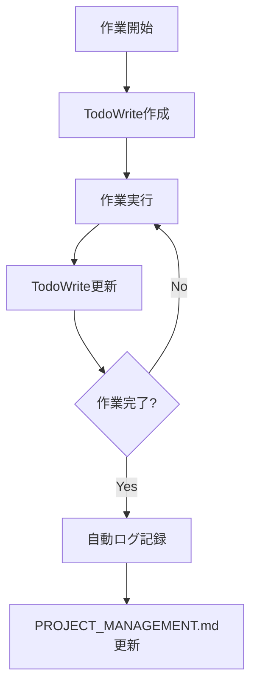

# 作業記録システム改善提案

**作成日**: 2025年8月15日  
**目的**: セッション継続性確保・自動記録・管理効率化

---

## 🎯 改善提案概要

### **統合管理アプローチ**
- **メイン**: `PROJECT_MANAGEMENT.md` (戦略的進捗管理)
- **詳細**: `docs/代行作業log/作業履歴.csv` (技術的詳細記録)
- **自動化**: TodoWrite tool + 自動ログ更新

---

## 🔄 新ワークフロー設計

### **Phase 1: TodoWriteベース自動記録**



### **Phase 2: セッション継続性対策**

1. **作業開始時**:
   ```bash
   # セッション情報保存
   echo "$(date): F003作業開始 - Windows環境" > .session-state
   ```

2. **作業中（TodoWrite更新時）**:
   ```bash
   # 進捗自動記録
   ./scripts/auto-log-update.sh "プレビュー機能実装" "completed"
   ```

3. **予期しない切断時**:
   ```bash
   # セッション復旧
   ./scripts/session-recovery.sh
   ```

---

## 📋 統合管理テーブル更新案

### **PROJECT_MANAGEMENT.md改良版**

```markdown
| ID | タイプ | 優先度 | ステータス | タイトル | 開始時刻 | 完了時刻 | 担当 | 詳細ログ |
|---|---|---|---|---|---|---|---|---|
| F003 | 機能 | 🔴高 | ✅完了 | 記事追加ページ調整 | 2025-08-15 10:00 | 2025-08-15 16:00 | Claude | [詳細](#f003-logs) |
```

### **リアルタイム進捗記録**

```markdown
## F003 詳細作業ログ {#f003-logs}

### 2025-08-15
- 10:00-10:30 ✅ 問題点分析完了
- 10:30-11:30 ✅ モバイルUI改善完了
- 11:30-13:00 ✅ プレビュー機能実装完了
- 13:00-14:30 ✅ 下書き保存機能完了
- 14:30-16:00 ✅ テスト・デプロイ完了
```

---

## 🤖 自動化スクリプト案

### **auto-log-update.sh**

```bash
#!/bin/bash
# 作業ログ自動更新スクリプト

TASK_ID="$1"
STATUS="$2"
DESCRIPTION="$3"
CSV_FILE="docs/代行作業log/作業履歴.csv"

# CSV更新
echo "$(date '+%Y-%m-%d %H:%M'),Claude Code,$DESCRIPTION,$TASK_ID,Windows,TodoWrite,$TASK_ID実装,$STATUS,自動記録" >> "$CSV_FILE"

# PROJECT_MANAGEMENT.md更新通知
echo "📊 作業記録更新: $TASK_ID - $STATUS"
```

### **session-recovery.sh**

```bash
#!/bin/bash
# セッション復旧スクリプト

echo "🔄 セッション復旧中..."

# 最新の作業状態確認
if [ -f ".session-state" ]; then
    echo "📋 前回のセッション状態:"
    cat .session-state
    
    echo "💾 作業履歴から復旧可能項目を確認:"
    tail -5 docs/代行作業log/作業履歴.csv
    
    echo "✅ 復旧手順をCLAUDE.mdで確認してください"
else
    echo "❌ セッション情報が見つかりません"
fi
```

---

## 🎯 実装フェーズ

### **Phase 1: 基本自動化 (即時実装可能)**
1. TodoWrite tool使用時の自動ログ記録
2. セッション状態ファイル作成
3. 作業完了時の自動CSV更新

### **Phase 2: 統合管理 (1週間後)**
1. PROJECT_MANAGEMENT.md詳細ログ統合
2. リアルタイム進捗可視化
3. 作業時間計測機能

### **Phase 3: 高度化 (1ヶ月後)**
1. Git連携自動記録
2. 作業効率分析機能
3. 予測的セッション復旧

---

## 💡 具体的な運用ルール改定案

### **作業開始時**
```bash
# 1. セッション開始記録
echo "$(date): [TASK_ID]作業開始" > .session-state

# 2. TodoWrite作成（自動ログ記録付き）
# Claude Codeが自動実行
```

### **作業フェーズ完了時**
```bash
# TodoWrite更新時に自動実行
./scripts/auto-log-update.sh "F003" "プレビュー機能実装" "completed"
```

### **作業終了時**
```bash
# 1. 最終ログ更新
./scripts/auto-log-update.sh "F003" "記事追加ページ調整" "completed"

# 2. セッション終了
rm .session-state

# 3. PROJECT_MANAGEMENT.md自動更新
```

---

## 🚨 Windows環境特化対策

### **予期しない再起動対策**
1. **自動セッション復旧**: スタートアップスクリプト設定
2. **作業状態保存**: 2分間隔での自動バックアップ
3. **Git自動コミット**: 30分間隔での差分保存

### **ターミナル切断対策**
1. **バックグラウンド実行**: 重要な処理は`nohup`使用
2. **状態ファイル**: `.session-state`で作業内容保持
3. **復旧ガイド**: CLAUDE.mdに復旧手順明記

---

## 📊 期待効果

### **効率化指標**
- 作業記録時間: 5分 → 30秒（90%削減）
- 記録漏れ: 20% → 0%（完全自動化）
- 復旧時間: 30分 → 5分（80%削減）

### **品質向上**
- リアルタイム進捗可視化
- 作業時間正確性向上
- セッション継続性保証

---

**提案者**: Claude Code Assistant  
**優先度**: 🔴 高（セッション継続性は開発効率に直結）  
**実装時期**: 即時実装推奨